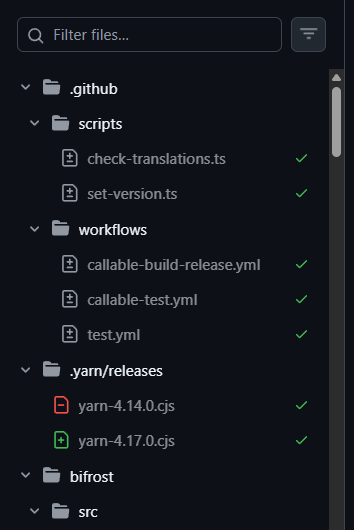
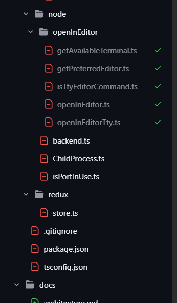
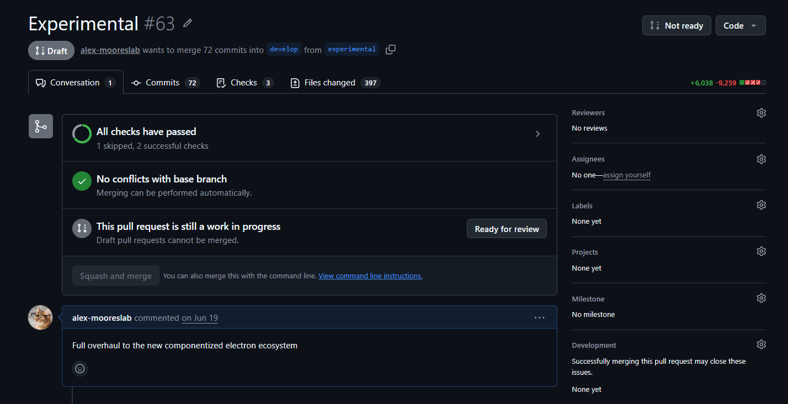

# GitHub PR Enhancer

**Make big pull requests reviewable again.**

---

A 400-file pull request should not fight you. This extension fixes the parts of GitHub's
review UI that fall apart at scale: scrolling that stutters, a sidebar that forgets what you
have read, a merge button buried under a thousand comments, and PDFs that will not render.

No account, no servers, no analytics. It runs entirely in your tab.

## What it does

### Scrolling stops stuttering

GitHub reserves a placeholder for every file scrolled out of view, then sometimes gets the
size badly wrong. On one real review, a `yarn.lock` entry reserved **175 pixels for roughly
49,000 pixels** of content. Every time it drifted past the viewport the page grew by 49,000
pixels in a single frame, then collapsed again on the way back. That is the lurch you feel,
and it is why checking a box can throw you somewhere else entirely.

The extension measures what is really there and reserves honestly. It also lets the browser
skip file tree rows scrolled out of the sidebar, which GitHub does not do at all.

### Track your review from the sidebar

Every file's "Viewed" state appears on its row in the file tree, so progress is visible at a
glance instead of requiring a scroll through the diff to find out.

Hover any row and a yellow checkmark appears: press it to mark that file reviewed, or press a
folder's to mark everything inside it. Press a green one to undo.

### Finished folders fold themselves away

When every file under a folder is reviewed, the folder checks itself and collapses, upwards as
far as the review is finished. What stays on screen is what is left to read.

### Merge without scrolling to the bottom

The merge panel moves to the top of the conversation, above the discussion instead of below
all of it. Scroll down and a dock appears in the bottom left with **Back to top** and your
repository's merge action, whether that is squash, rebase, or a merge commit.

The dock's merge button is a proxy: it mirrors the real button's label and its disabled state,
and pressing it presses the real one. GitHub's usual commit message confirmation still
follows, so nothing merges behind your back.

### PDFs render inline

PDF files that GitHub shows as `Binary file not shown.` are replaced with an inline preview of
the new version, plus a link to open it in a tab. Private repositories included.

## Install

From the Chrome Web Store, or load it yourself:

1. Download the latest release, or clone this repository and run `npm install && npm run build`.
2. Open `chrome://extensions` and turn on **Developer mode**.
3. Choose **Load unpacked** and select the `dist` folder.

Requires Chrome 120 or newer.

## Privacy

The extension collects nothing, stores nothing, and sends nothing anywhere. It has no servers
and no analytics.

It requests access to `github.com` because that is where it runs, and to
`*.githubusercontent.com` because GitHub redirects raw file downloads there, which is what
makes the inline PDF preview work. Nothing else.

Full detail in [PRIVACY.md](PRIVACY.md).

## Support

Found a bug, or has GitHub changed something the extension no longer recognises?
[Open an issue](https://github.com/JalapenoLabs/github-tweaks/issues).

## Contributing

Build instructions, architecture, and how to test against a captured GitHub page are in
[DEVELOPER.md](DEVELOPER.md).

## License

[MIT](LICENSE). Copyright © 2026 Alex Navarro, Jalapeno Labs.

Not affiliated with, endorsed by, or sponsored by GitHub, Inc. "GitHub" is a trademark of
GitHub, Inc., used here only to describe what this extension works with.
